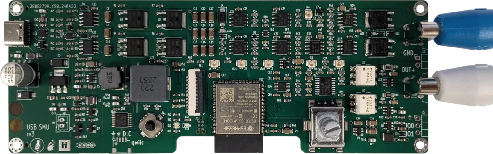
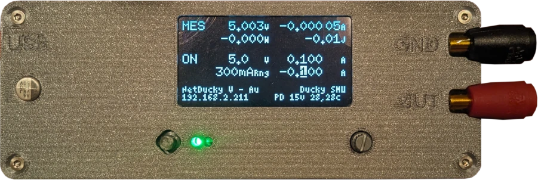
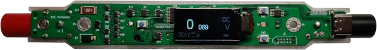
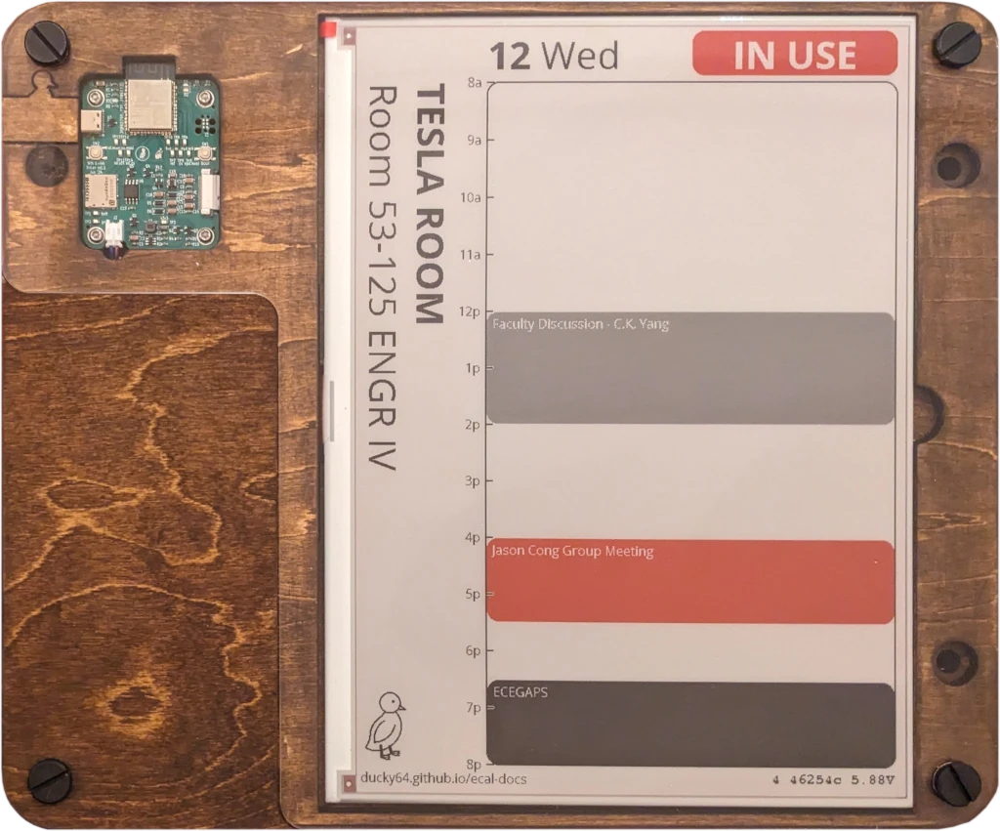
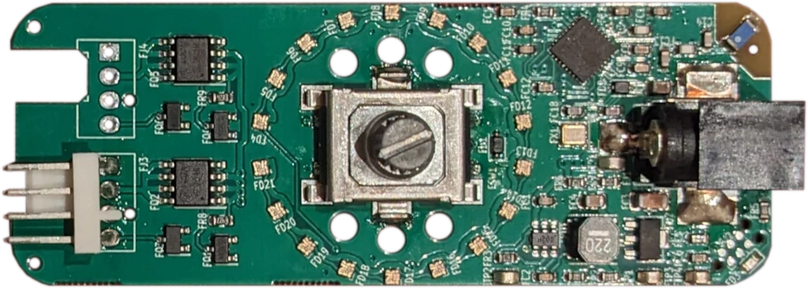
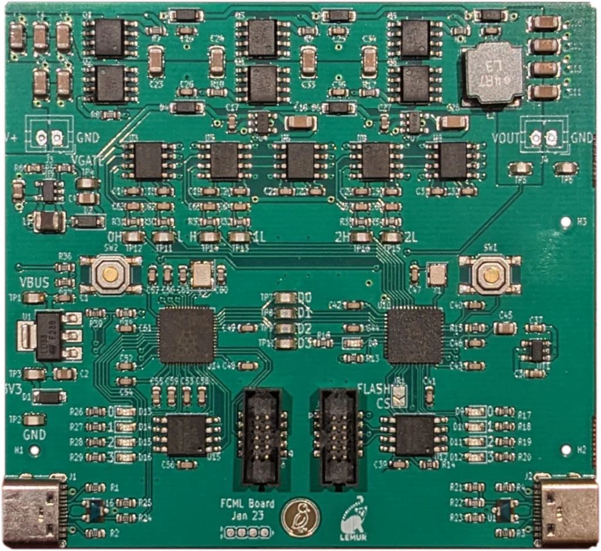
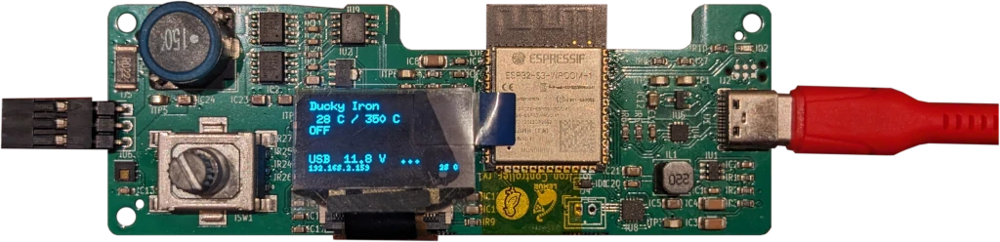
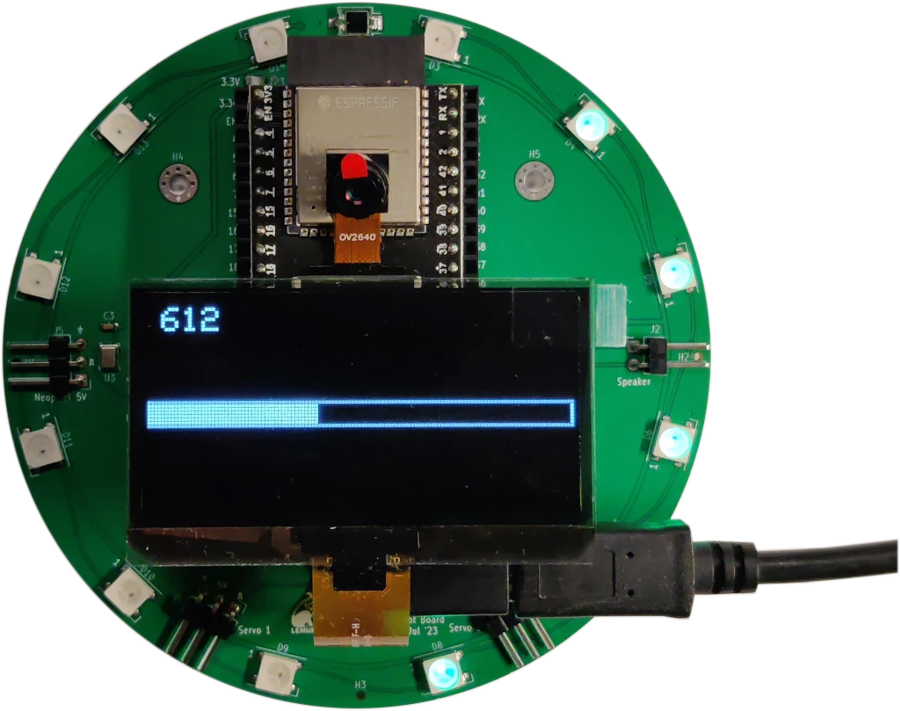
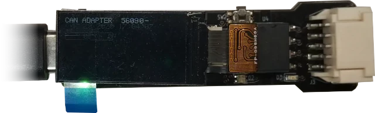

# Boards

These are some of the more interesting boards that I've designed as part of my research into a hardware description language for boards.
Beyond simple demo boards, many of these are practically useful devices and deployed.
All these are fully open-source.

## USB Source-Measure

- **Links**: [HDL Source](https://github.com/BerkeleyHCI/PolymorphicBlocks/blob/master/examples/test_usb_source_measure.py),
  [Layout](https://github.com/BerkeleyHCI/PolymorphicBlocks/tree/master/examples/UsbSourceMeasure),
  [Firmware](https://github.com/ducky64/edg-pcbs/blob/main/IoTDevices/iotusbsourcemeasure.yml),
  [PC Interface](https://github.com/ducky64/edg-pcbs/tree/main/IoTDevices/SmuRemoteControl),
  [Case (OpenSCAD)](https://github.com/ducky64/edg-pcbs/tree/main/UsbSmu/mechanical)
    - **Note**: while the current revision (v3) is functional with blue wire fixes, another revision (v3.1) is planned.
- **Microcontroller**: ESP32-S3, **Power**: USB-C PD (FUSB302)
- **Firmware**: ESPHome with custom drivers
- **Notable features**: discrete synchronous buck-boost converter driven by the ESP32, analog feedback controls for current and voltage (voltage setpoint + current limits), current ranging circuit, local interface with OLED and encoder + 4-way switch

- **Output / measurement range**: 0 - 30V, -3 - +3A (electrical limits, thermal limits may be lower; two quadrant operation)
- **Output resolution**: 10mV, 10mA / 1mA (for 3A / 300mA ranges) (12-bit DAC, MCP4728)
- **Measurement resolution** (noise floor): 1mV, 100uA / 10uA (for 3A / 300mA ranges) (24-bit ADC, MCP3561)

The USB SMU is a portable lab power supply that can both source and sink current.
USB-PD enables it to be powered from battery banks and laptop or phone chargers where mains power may be unavailable, while WiFi connectivity enables remote control and logging.
A buck-boost converter enables the output voltage to be higher than the PD input (up to 30V out) while its efficiency reduces size from heat management.
This could also act as a bench multimeter.

The initial motivation for this design came from my solar car racing days, where it would be common to need a DC power supply but either have the one team had be in use or difficult to access (like buried in the back of the trailer).
A device like this could instead be carried on your person and powered from a laptop charger.

The analog stage is based off the [PS-Load project](https://www.djerickson.com/ps-load/), but restructured for the HDL compiler.

This is a collaborative project with [Prof. Yang Zhang's HiLab](https://hilab.dev/), with applications to aid in the development of energy harvesting devices.

## Stick BLE Multimeter

- **Links**: [HDL Source](https://github.com/BerkeleyHCI/PolymorphicBlocks/blob/master/examples/test_multimeter.py),
  [Layout](https://github.com/BerkeleyHCI/PolymorphicBlocks/tree/master/examples/Multimeter),
  [Firmware](https://github.com/CalSol/Devops-BLE-FW/tree/main/Multimeter),
  [Android app](https://github.com/ducky64/BleMultimeterApp),
  [Case (FreeCAD)](https://github.com/BerkeleyHCI/PolymorphicBlocks/tree/master/examples/Multimeter/mechanical)
    - **Note**: another revision (v3) is planned to improve measurement noise.
- **Microcontroller**: nRF52840, **Power**: internal 1xAA (alkaline or LFP or Li-ion)
- **Firmware**: mbed + PlatformIO
- **Notable features**: measurement and constant-current driver ranging circuits

- **Modes**: voltage / resistance / diode / continuity
- **Measurement ranges**: 1:1, 1:10, 1:100, 1:1000 voltage attenuation
  - High voltage withstand (>40V) NOT physically tested (yet)
- **Current driver ranges**: 1uA, 10uA, 100uA, 1mA; with PWM DAC for fine control
- **Measurement resolution** (noise floor): ~4 digits (24-bit ADC, MCP3561)

This is a multimeter in a compact form factor, able to operate in standalone mode (through integrated display and speaker) or connected to a smartphone as a remote display (and perhaps beyond).

This was similarly motivated by solar car racing - where we would either misplace or break the team multimeters.
A compact device like this could instead be carried on your person or stowed in your day pack without eating up too much space.
Inspired by the [TI BLE multimeter reference design](https://www.ti.com/tool/TIDA-01012).

## E-ink Calendar

- **Links**: [HDL Source](https://github.com/BerkeleyHCI/PolymorphicBlocks/blob/master/examples/test_iot_display.py),
  [Layout](https://github.com/BerkeleyHCI/PolymorphicBlocks/tree/master/examples/IotDisplay),
  [Firmware](https://github.com/ducky64/edg-pcbs/tree/main/IoTDisplay),
  [Image server](https://github.com/ducky64/eink-svg-server)
- **Microcontroller**: ESP32-S3, **Power**: 4xAA NiMH (expected 1 year battery life), accepts any 4.5-20v source
- **Firmware platform**: Arduino + PlatformIO
- **Notable features**: low sleep current (80uA), reverse input protected, e-ink display, display templates in SVG

This is an e-ink display driver, compatible with many 24-pin e-ink panels, with the reference panel being a 13.3" black/red/white display.
Battery power allows this to be standalone (without the expensive facilities work to run mains power or ugly wires), while low sleep current allows long battery life.
The device wakes up to fetch image data from WiFi, sends it to the screen, then goes back to sleep.
The firmware supports OTA firmware updates and also reports statistics like battery level to the server.

This is a collaborative project with the UCLA ECE department and these are deployed outside the departmental meeting rooms to show the room calendar.
Mechanical design by [Yusuke Tanaka](https://uclalemur.com/people/yusuke-tanaka).
If you're ever around UCLA Engineering IV 5th floor, look for these! 

## IoT Fan Driver

- **Links**: [HDL Source](https://github.com/BerkeleyHCI/PolymorphicBlocks/blob/master/examples/test_iot_fan.py),
  [Layout](https://github.com/BerkeleyHCI/PolymorphicBlocks/tree/master/examples/IotFan),
  [Firmware](https://github.com/ducky64/edg-pcbs/blob/main/IoTDevices/iotfandriver_r2.yml)
    - Note: broken ground plane significantly reduces RF performance, can be fixed with copper tape and a solder blob
- **Microcontroller**: ESP32-C3, **Power**: 12v barrel jack
- **Firmware platform**: ESPHome
- **Notable features**: discrete RF layout, programmatically generated LED ring layout using SVG-PCB

It's exactly what the name says, it controls two PC case fans from the intertubes or using a local rotary encoder.
An RGB LED ring around the encoder can indicate the current speed setting.
On the technical side, this has a discrete ESP32-C3 layout with (including discrete RF section, which mostly worked) instead of using an integrated module.

## Multilevel Converter Prototype

- **Links**: [HDL Source](https://github.com/BerkeleyHCI/PolymorphicBlocks/blob/master/examples/test_fcml.py),
  [Layout](https://github.com/BerkeleyHCI/PolymorphicBlocks/tree/master/examples/Fcml),
  [RTL](https://github.com/calisco/fcml-rtl)
- **FPGA**: iCE40UP5k
- **Gateware**: Chisel
- **Notable features**: FPGA, multilevel converter generator (this device is 4-level)

More of a technical testbed than a practical device, this implements a 4-level flying capacitor multilevel (FCML) buck converter controlled by an FPGA.
FCML converters enable vastly lower inductances (and reduce the size of one of the largest components) at the cost of more semiconductor switches and capacitors.
A few basic tests have been run with this device, and it does process power efficiently.

## Soldering Iron Controller

- **Links**: [HDL Source](https://github.com/BerkeleyHCI/PolymorphicBlocks/blob/master/examples/test_iot_iron.py),
  [Layout](https://github.com/BerkeleyHCI/PolymorphicBlocks/tree/master/examples/IotIron),
  [Firmware](https://github.com/ducky64/edg-pcbs/blob/main/IoTDevices/iotiron.yml)
- **Microcontroller**: ESP32-S3, **Power**: USB-C PD (FUSB302)
- **Firmware**: ESPHome
- **Notable features**: discrete synchronous buck converter driven by the ESP32, compatible with JBC cartridges

This is a controller (think power station replacement) for JBC soldering iron cartridges.
USB-C PD power enables this to be used as a field tool, while WiFi connectivity allows optional remote control and data logging.

This was one of the first devices in the HDL compiler to have a discrete power converter and paved the way for the later USB SMU design.

## "Owlbot"

- **Links**: [HDL Source](https://github.com/BerkeleyHCI/PolymorphicBlocks/blob/master/examples/test_robotowl.py),
  [Layout](https://github.com/BerkeleyHCI/PolymorphicBlocks/tree/master/examples/RobotOwl)
- **Microcontroller**: ESP32-S3 socketed dev board
- **Firmware**: Arduino IDE / ESPHome

This was an educational board for the [introduction to embedded systems sections](https://github.com/ducky64/lacc23-embedded/blob/lacc-23/lab2_1.md) of [LACC](https://sites.google.com/site/computingcircle/), an outreach event for local high school students.
During the optional in-person day, students used these to get (exciting, we hope) hands-on experience with programming embedded systems with Arduino and experiment with peripherals like the OLED display.

The name came from the original design intent of this being a controller for an animatronic owl, though the mechanical housing did not happen in time, so the lab focused on the RGB puck, light sensor, and OLED display.
This had a 30 unit production run.

## CANdapter

- **Links**: [HDL Source](https://github.com/BerkeleyHCI/PolymorphicBlocks/blob/master/examples/test_can_adapter.py),
  [Layout](https://github.com/BerkeleyHCI/PolymorphicBlocks/tree/master/examples/CanAdapter),
  [Firmware](https://github.com/CalSol/Devops-FW/tree/main/Candapter)
- **Microcontroller**: LPC1549
- **Firmware**: mbed + PlatformIO

A CANbus-USB adapter speaking the SLCAN protocol, used for solar car debugging - because debugging with data is always better than debugging-by-guess-and-check.
An onboard LCD display shows summary statistics like packet rate and error rate. 
