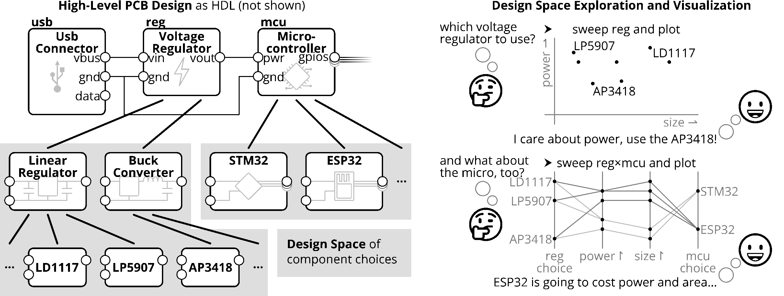
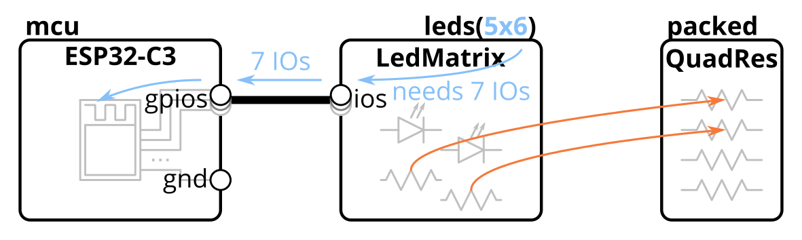
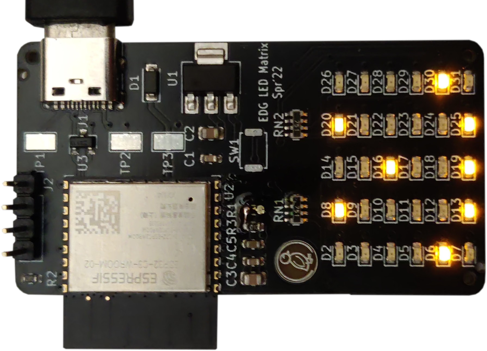
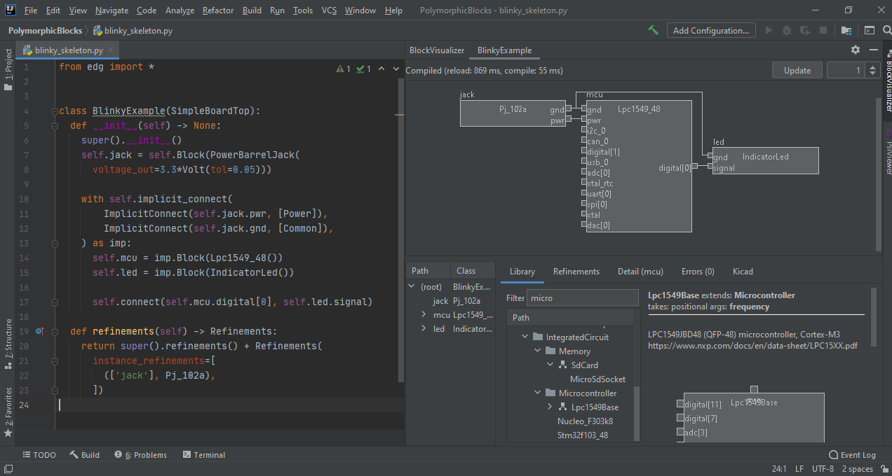
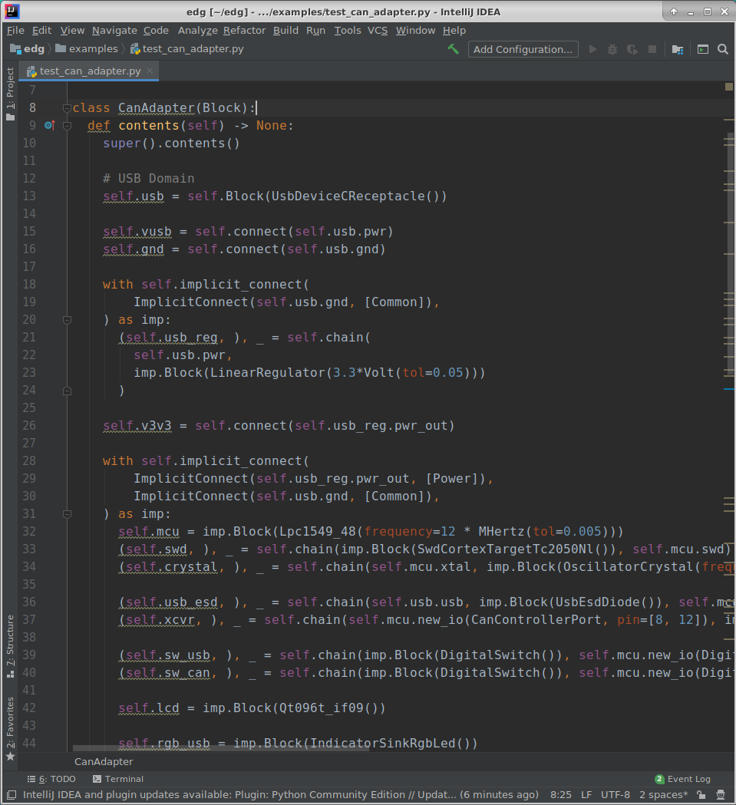
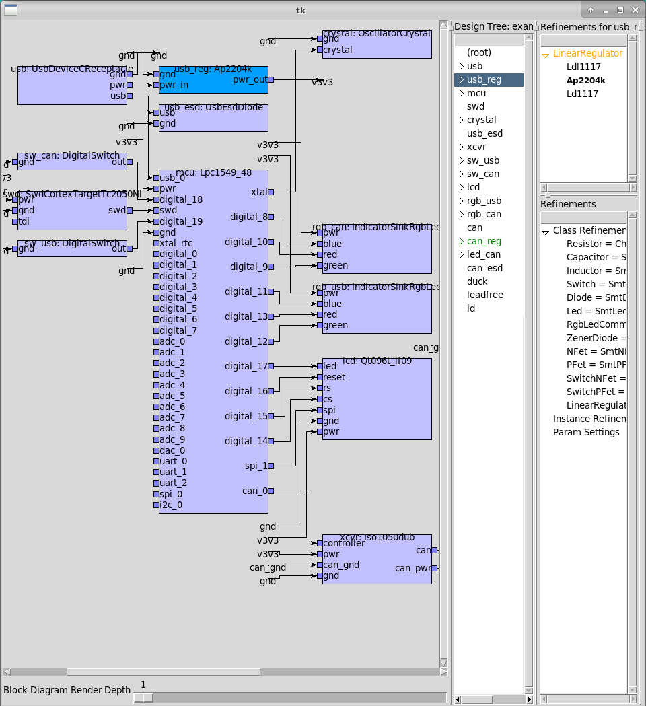
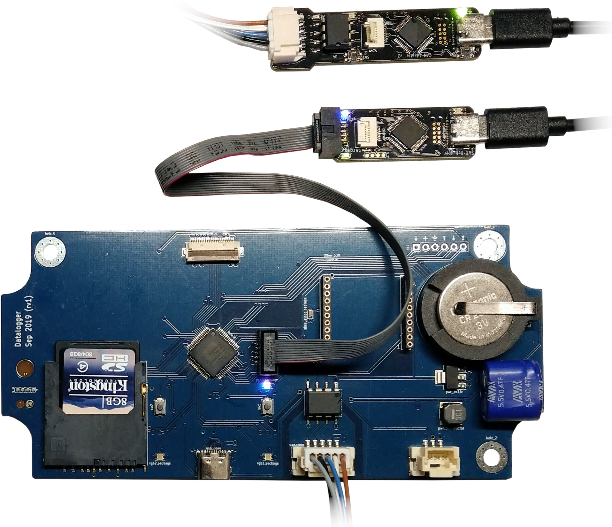
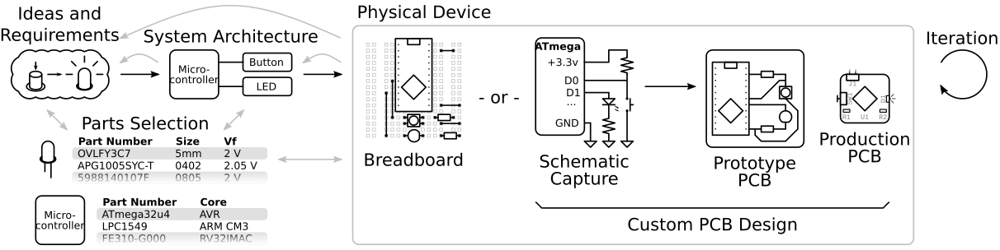
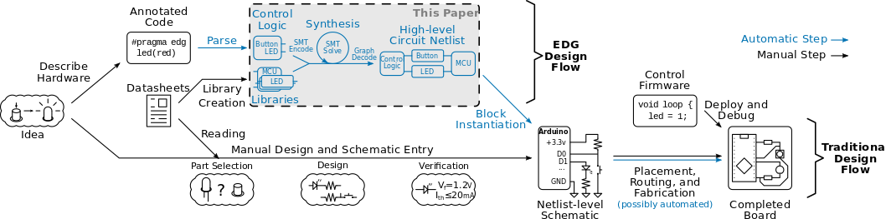

## Research

### Board-level Electronics Design
My main work is on bringing the large-scale, community-driven, library-based design processes seen in software development to circuit board (PCB) design to make electronics design easier, faster, and much more fun for everyone.
The central part of this system is a hardware description language (HDL) and compiler for circuit design that adapts great ideas from software engineering to hardware design, for example using code to generate and specialize circuits to different applications, and using type systems to describe generic parts and subcircuits.
These publications describe some of the individual research ideas that are part of this system.

This project is fully open-source and actively developed! **[Project repository and source code are here](https://github.com/BerkeleyHCI/PolymorphicBlocks)**, including a **[getting started tutorial](https://github.com/BerkeleyHCI/PolymorphicBlocks/blob/master/getting-started.md)**.
Give it a try and let me know what you think!

Once in a while, updates are posted to the [LEMUR lab's blog](https://uclalemur.com/blog).

Research Papers

- **[Design Space Exploration for Board-level Circuits: Exploring Alternatives in Component-based Design](https://doi.org/10.1145/3613904.3642009)** (open-access) \\
  **Richard Lin**, Rohit Ramesh, Parth Pandhare, Kai Jun Tay, Prabal Dutta, Björn Hartmann, and Ankur Mehta \\
  *Proceedings of the 2024 CHI Conference on Human Factors in Computing Systems* (*CHI '24*) \\
    \\
  - Source code is part of the IDE repository below

- **[Computational Support for Multiplicity in Hierarchical Electronics Design](https://doi.org/10.1145/3559400.3561997)** (open-access) \\
  **Richard Lin**, Rohit Ramesh, Prabal Dutta, Björn Hartmann, and Ankur Mehta \\
  *The 7th Annual ACM Symposium on Computational Fabrication* (*SCF '22*) \\
  
    \\
  - Source code is part of the main project repository
  - [Conference recording of the day](https://www.youtube.com/watch?v=0tjI8P1KC1M) (starts about an hour in)

- **[Weaving Schematics and Code: Interactive Visual Editing for Hardware Description Languages](https://dl.acm.org/doi/10.1145/3472749.3474804)** (open-access, including short talk video) \\
  **Richard Lin**, Rohit Ramesh, Nikhil Jain, Josephine Koe, Ryan Nuqui, Prabal Dutta, and Björn Hartmann \\
  *The 34th Annual ACM Symposium on User Interface Software and Technology* (*UIST '21*) \\
    \\
  - [Source Code](https://github.com/BerkeleyHCI/edg-ide) (note, while this is in a separate repository, this is part of the main getting started tutorial)

- **[Polymorphic Blocks: Unifying High-level Specification and Low-level Control for Circuit Board Design](https://doi.org/10.1145/3379337.3415860)** (open-access, include short talk video) \\
  **Richard Lin**, Rohit Ramesh, Connie Chi, Nikhil Jain, Ryan Nuqui, Prabal Dutta, and Björn Hartmann \\
  *Proceedings of the 33rd Annual ACM Symposium on User Interface Software and Technology* (*UIST '20*) \\
  
  
    \\
  - Source code is part of the main project repository

- **[Beyond Schematic Capture: Meaningful Abstractions for Better Electronics Design Tools](https://doi.org/10.1145/3290605.3300513)** (open-access, including recorded talk video) \\
  **Richard Lin**, Rohit Ramesh, Antonio Iannopollo, Alberto Sangiovanni Vincentelli, Prabal Dutta, Elad Alon, and Björn Hartmann \\
  *Proceedings of the 2019 CHI Conference on Human Factors in Computing Systems* (*CHI '19*) \\
  

- **[Turning *coders* into *makers*: the promise of embedded design generation](https://doi.org/10.1145/3083157.3083159)** \\
  Rohit Ramesh, **Richard Lin**, Antonio Iannopollo, Alberto Sangiovanni-Vincentelli, Björn Hartmann, and Prabal Dutta \\
  *Proceedings of the 1st Annual ACM Symposium on Computational Fabrication* (*SCF '17*) \\
   \\
  - [Source Code](https://github.com/lab11/edg-sat-prototype)

Short papers

- **Greyboxing: towards domain-specific representations for domain-specific languages in electronics design** (coming soon) \\
  **Richard Lin**, Rohit Ramesh, Prabal Dutta, Björn Hartmann, and Ankur Mehta \\
  *[PLATEAU '23 Workshop](https://2023.plateau-workshop.org/)*

- **[Opportunities and Challenges for Circuit Board Level Hardware Description Languages](HATRA20_PCB_HDLs.pdf)** \\
  **Richard Lin** and Björn Hartmann \\
  *HATRA '20 Workshop*

- **[Supporting Circuit Design with a Block-Based, Generator Language](https://doi.org/10.1145/3334480.3382887)** \\
  **Richard Lin**, Rohit Ramesh, Connie Chi, Nikhil Jain, Prabal Dutta, and Björn Hartmann \\
  *Extended Abstracts of the 2020 CHI Conference on Human Factors in Computing Systems* (*CHI EA '20*)
  
### Chip-level Digital Design
These publications are all part of the [Chisel](https://www.chisel-lang.org/) project, an [open-source](https://github.com/freechipsproject/chisel3) and [production-tested](https://www.sifive.com/) hardware description language (HDL) that provides principled generators (think metaprogramming Verilog) for digital logic design.

- **[A Mixed-Signal RISC-V Signal Analysis SoC Generator With a 16-nm FinFET Instance](https://doi.org/10.1109/JSSC.2019.2924090)** \\
  Steven Bailey, Paul Rigge, Jaeduk Han, **Richard Lin**, Eric Chang, Howard Mao, Zhongkai Wang, Chick Markley, Adam Izraelevitz, Angie Wang, Nathan Narevsky, Woorham Bae, Steve Shauck, Sergio Montano, Justin Norsworthy, Munir Razzaque, Wen Hau Ma, Akalu Lentiro, Matthew Doerflein, Darin Heckendorn, Jim McGrath, Franco DeSeta, Ronen Shoham, Mike Stellfox, Mark Snowden, Joseph Cole, Daniel Fuhrman, Brian Richards, Jonathan Bachrach, Elad Alon, and Borivoje Nikolić \\
  Oct 2019, *IEEE Journal of Solid-State Circuits*

- **[Reusability is FIRRTL ground: Hardware construction languages, compiler frameworks, and transformations](https://doi.org/10.1109/ICCAD.2017.8203780)** \\
  Adam Izraelevitz, Jack Koenig, Patrick Li, **Richard Lin**, Angie Wang, Albert Magyar, Donggyu Kim, Colin Schmidt, Chick Markley, Jim Lawson, and Jonathan Bachrach \\
  2017, *IEEE/ACM International Conference on Computer-Aided Design* (*ICCAD*)

Related projects (without standalone publications)
- **[ChiselTest](https://github.com/ucb-bar/chisel-testers2)**, an RTL testing framework that focuses on usability and simplicity in a pure imperative framework (instead of Verilog/VHDL's mixed imperative and hardware construction semantics)

- **[chisel-jtag](https://github.com/ucb-art/chisel-jtag)**, a JTAG TAP (test access port) generator for Chisel

- **[builtin-debugger](https://github.com/ucb-art/builtin-debugger)**, parameterized built-in logic analyzer and pattern generator modules for Chisel

### Other
- **[Guardians of Practice: A Contextual Inquiry of Failure-Mitigation Strategies within Creative Practices](https://doi.org/10.1145/3196709.3196795)** \\
  Cesar Torres, Sarah Sterman, Molly Nicholas, **Richard Lin**, Eric Pai, and Eric Paulos \\
  *Proceedings of the 2018 Designing Interactive Systems Conference* (*DIS '18*)

- **[JITPCB](https://doi.org/10.1109/IROS.2016.7759349)** \\
  Jonathan Bachrach, David Biancolin, Austin Buchan, Duncan Haldane, and **Richard Lin** \\
   2016, *IEEE/RSJ International Conference on Intelligent Robots and Systems* (*IROS*)

## Teaching

### EE192 (Mechatronics Design Lab), UC Berkeley
**[Spring 2020](https://inst.eecs.berkeley.edu/~ee192/sp20/)**, co-Graduate Student Instructor \\
**[Spring 2015](https://inst.eecs.berkeley.edu/~ee192/sp15/)**, Graduate Student Instructor (Outstanding GSI Award)

EE192 is an undergraduate design project class, where students build a line-following ~1:10 scale race car.
Students start from a stock chassis with motor and servo, and design and assemble custom circuit boards for power conversion and logic, and write the firmware including controls loops (typically PID).
Students work in groups of three, and the semester-long interdisciplinary project involves hands-on, practical mechanical engineering, electrical engineering, and computer science.

In 2015, my focus was on developing a [re-usable slide deck for discussion / lab sections](https://github.com/ucb-ee192/course-site) and on writing a [live telemetry visualization system](https://github.com/ucb-ee192/telemetry) to encourage students to work with data instead of debugging by trial-and-error 🤦‍.

In 2020 and along with co-GSI Derek Chou, we focused on refactoring the course to get students to a working car as soon as possible by providing the first iteration electronics as a circuit board kit.
We hoped a reference circuit board would help demonstrate the implicit knowledge of what makes good circuit boards, while going through the assembly process would provide students design-for-manufacturing (DFM) intuition when they build their own.
While we didn't know it at the beginning of the semester, this turned out to be invaluable for the pandemic: all students had working cars and controls by the time the lockdown hit, and we consider this an extremely lucky success.
For the rest of the semester, we shifted focus to controls and learning (track memorization) in simulation in V-REP.

## Education
- PhD in Computer Science, UC Berkeley (2013-2021) \\
  Co-advised by Björn Hartmann and Elad Alon

- BS in Electrical Engineering and Computer Sciences, UC Berkeley (2009-2013)

## Other

### CalSol
I've been part of the [UC Berkeley Solar Vehicle Team](https://calsol.berkeley.edu/) (we design, build, test, and race solar racing cars) since my first year in undergraduate.
Some of our design materials are [open source on GitHub](https://github.com/CalSol), including [firmware shared libraries](https://github.com/CalSol/calsol-fw-libs) and our [hands-on electronics training lab for new members](https://github.com/CalSol/braintrain).

There is a good deal of crossover between my research projects and CalSol projects, with the active battery balancing system (on [Zephyr](https://calsol.berkeley.edu/vehicles/)) containing RTL written in Chisel and tested with ChiselTest, and with the [lights controller](https://github.com/BerkeleyHCI/PolymorphicBlocks/tree/uist20-submit/examples/test_high_switch) and [datalogger](https://github.com/BerkeleyHCI/PolymorphicBlocks/tree/uist20-submit/examples/test_datalogger) on [Tachyon](https://calsol.berkeley.edu/vehicles/)) having their PCBs designed in Polymorphic Blocks.

Engineering aside, I've served as treasurer for many years, automating reimbursements paperwork generation with Python.
Unsurprisingly, it turns out that purchasing and reimbursements are kind of important for a physical project as large as CalSol.
